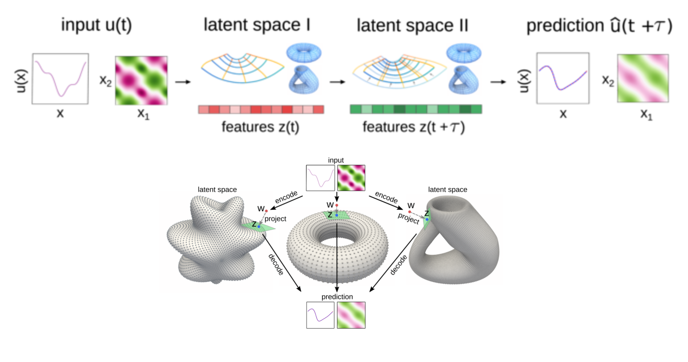

## GD-VAE: Geometric Dynamic Variational Autoencoders

<div  align="center">

</div>


**Geometric Dynamic Variational Autoencoders (GD-VAE) package** provides machine learning methods for learning embedding maps for nonlinear dynamics into general latent spaces.  This includes methods for standard latent spaces or manifold latent spaces with specified geometry and topology.  The manifold latent spaces can be based on analytic expressions or general point cloud representations.  

__Quick Start__

*Method 1:* Install for python using pip

```pip install -U gd-vae-pytorch```

For use of the package see the [examples
page](https://github.com/gd-vae/gd-vae/tree/master/examples).  More
information on the structure of the package also can be found on the
[documentation page](https://github.com/gd-vae/gd-vae/tree/master/docs).

If previously installed the package, please update to the latest version using
```pip install --upgrade gd-vae-pytorch```

To test the package installed use 
```import gd_vae_pytorch.tests.t1 as t1; t1.run()```

__Packages__ 

Please be sure to install [PyTorch](https://pytorch.org/) package >= 1.2.0 with
Python 3 (ideally >= 3.7).  Also, be sure to install the following packages:
numpy>=1.16, scipy>=1.3, matplotlib>=3.0.

__Use__

For examples and documentation, see

[Examples](https://github.com/gd-vae/gd-vae/tree/main/examples)

[Documentation](http://web.math.ucsb.edu/~atzberg/gd_vae_docs/html/index.html)

__Additional Information__

If you find these codes or methods helpful for your project, please cite: 

*GD-VAEs: Geometric Dynamic Variational Autoencoders for 
Learning Non-linear Dynamics and Dimension Reductions,*
R. Lopez and P. J. Atzberger, arXiv:2206.05183, (2022), 
[[arXiv]](http://arxiv.org/abs/2206.05183).
```
@article{lopez_atzberger_gd_vae_2022,
  title={GD-VAEs: Geometric Dynamic Variational Autoencoders for 
  Learning Non-linear Dynamics and Dimension Reductions},
  author={Ryan Lopez, Paul J. Atzberger},
  journal={arXiv:2206.05183},  
  month={June},
  year={2022},
  url={http://arxiv.org/abs/2206.05183}
}
```

__Acknowledgements__
This work was supported by grants from DOE Grant ASCR PHILMS DE-SC0019246 
and NSF Grant DMS-1616353.

----

[Examples](https://github.com/gd-vae/gd-vae/tree/master/examples) | [Documentation](http://web.math.ucsb.edu/~atzberg/gd_vae_docs/html/index.html) | [Atzberger Homepage](http://atzberger.org/)


