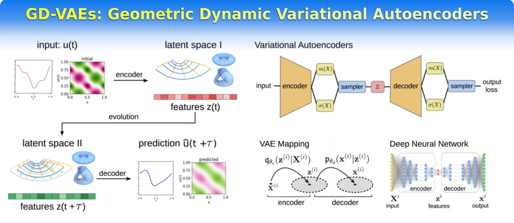
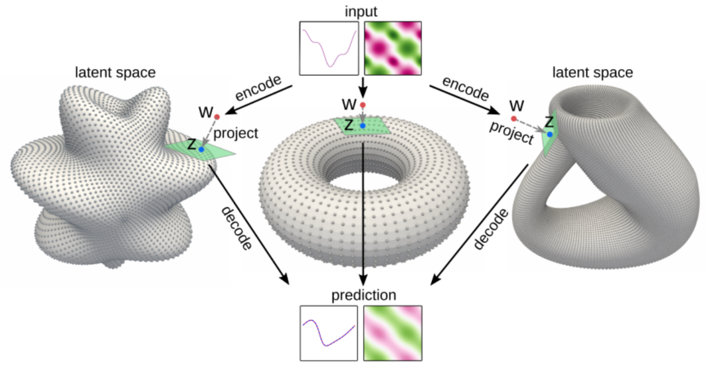

<div  align="left">

</div>

[Examples](https://github.com/gd-vae/gd-vae/tree/master/examples) |
[Documentation](https://web.atzberger.org/gd_vae_docs/html/index.html) |
[Paper](https://doi.org/10.1016/j.jcp.2025.114127) |
[arXiv](https://arxiv.org/abs/2206.05183)

### GD-VAE: Geometric Dynamic Variational Autoencoders  

Approaches for learning nonlinear dynamics by learning maps and embeddings into general latent spaces.  

#### 🚀 Core Functionality

- **Manifold Latent Spaces:** Supports both standard and general geometries and topologies for the embeddings.
- **Point-Cloud Representations:** Latent spaces can be represented non-analytically as point clouds.
- **Adjoint Methods for General Latent Spaces:** Provides approaches for handling general latent spaces through solving adjoint problems.
- **Modularity:** Readily supports use within existing models and data-processing pipelines.

#### 🤖 __Quick Start__

*Method 1:* Install for python using pip

```pip install -U gd-vae-pytorch```

For use of the package see the [examples folder](https://github.com/gd-vae/gd-vae/tree/master/examples).  More
information on the structure of the package also can be found on the
[documentation pages](https://github.com/gd-vae/gd-vae/tree/master/docs).

If previously installed the package, please update to the latest version using
```pip install --upgrade gd-vae-pytorch```

To test the package installed use 
```import gd_vae_pytorch.tests.t1 as t1; t1.run()```

#### 📦 __Packages__ 

The pip install should automatically handle most of the dependencies.  If there are
issues, please be sure to install [pytorch](https://pytorch.org/) package version >= 1.2.0.
The full set of dependencies can be found in the [requirements.txt](./requirements.txt).
You may want to first install pytorch package manually to configure it for your specific
GPU system and platform.

__Usage__

For information on how to use the package, see

- [Examples Folder](https://github.com/gd-vae/gd-vae/tree/main/examples)

- [Documentation Pages](https://web.atzberger.org/gd_vae_docs/html/index.html)

<div  align="left">

</div>


📚 __Additional Information__

When using this package, please cite: 


*GD-VAEs: Geometric dynamic variational autoencoders for learning
nonlinear dynamics and dimension reductions,*
R. Lopez and P. J. Atzberger, Journal of Computational Physics, 114127, (2025), 
[[paper]](https://doi.org/10.1016/j.jcp.2025.114127)
```
@article{lopez_atzberger_gdvae_2025,
  title={GD-VAEs: Geometric dynamic variational autoencoders for learning
         nonlinear dynamics and dimension reductions},
  author={Lopez, Ryan and Atzberger, Paul J},
  journal={Journal of Computational Physics},
  pages={114127},
  year={2025},
  publisher={Elsevier}
}
```

*GD-VAEs: Geometric Dynamic Variational Autoencoders for 
Learning Non-linear Dynamics and Dimension Reductions,*
R. Lopez and P. J. Atzberger, arXiv:2206.05183, (2022), 
[[arXiv]](http://arxiv.org/abs/2206.05183).
```
@article{lopez_atzberger_gdvae_2022,
  title={GD-VAEs: Geometric Dynamic Variational Autoencoders for 
         Learning Non-linear Dynamics and Dimension Reductions},
  author={Ryan Lopez, Paul J. Atzberger},
  journal={arXiv:2206.05183},  
  month={June},
  year={2022},
  url={http://arxiv.org/abs/2206.05183}
}
```

__Acknowledgements__
This work was supported by grants from DOE Grant ASCR PHILMS DE-SC0019246 
and NSF Grant DMS-1616353.

__Additional Information__ <br>
https://web.atzberger.org

----

[Examples](https://github.com/gd-vae/gd-vae/tree/master/examples) |
[Documentation](https://web.atzberger.org/gd_vae_docs/html/index.html) |
[Paper](https://doi.org/10.1016/j.jcp.2025.114127) |
[arXiv](https://arxiv.org/abs/2206.05183) |
[Atzberger Homepage](http://atzberger.org/)

