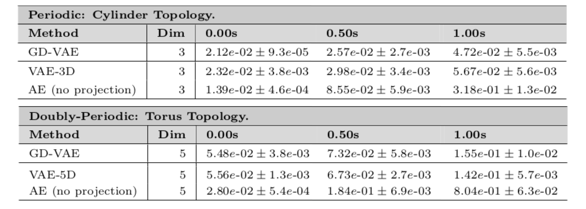
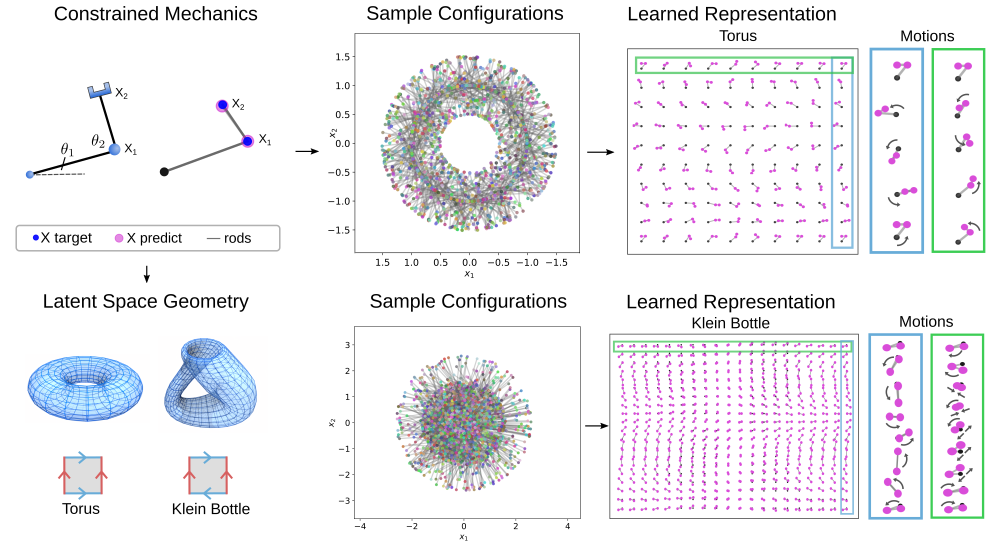
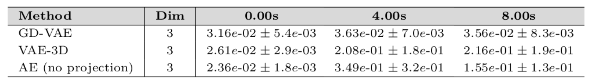
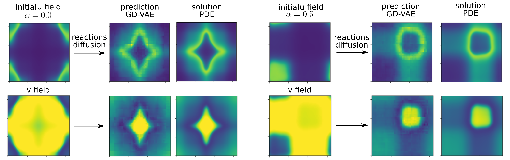

# Summary

The ``GD-VAEs`` software package provides approaches for data-driven learning
of representations for states and non-linear dynamics over both standard and
general manifold latent spaces.  Methods are provided allowing for
representations incorporating information in the form of geometric and
topological structures arising from constraints, periodicity, and other
properties of the dynamics.  Training approaches are provided for learning
encoders and decoders using training strategies related to Variational
Autoencoders (VAEs).  Representations can be learned based on deep neural
network architectures that include general Multilayer Perceptrons (MLPs),
Convolutional Neural Networks (CNNs), and Transpose CNNs (T-CNNs).  Motivating
applications include parameterized PDEs, constrained mechanical systems,
reductions in non-linear systems, and other tasks involving dynamics.   The
package is implemented currently in PyTorch.  The source code for this initial
version 1.0.0 of ``GD-VAEs`` has been archived to Zenodo with a DOI in
[@zenodo].  For related papers, examples, updates, and additional information
see <https://github.com/gd-vae/gd-vae> and <http://atzberger.org/>.

# Statement of Need

A central challenge in learning non-linear dynamics is to obtain
representations not only capable of reproducing similar outputs as observed in
the training data set but to infer more inherent structures for performing
simulations or making long-time predictions.  We develop methods for learning
more robust non-linear models by providing ways to incorporate underlying
structural information related to smoothness, physical principles,
topology/geometry, and other properties of the dynamics.  We focus particularly
on developing generative models using Probabilistic Autoencoders (PAEs) that
incorporate noise-based regularizations and priors on manifold latent spaces to
learn lower dimensional representations from observations.  This provides the
basis of non-linear state space models for simulations and predictions.  The
methods provide ways to learning representations over both standard and
more general manifold latent spaces with prescribed topology/geometry.  This
facilitates capturing both quantitative and qualitative features of the dynamics
to enhance robustness and interpretability of results.  The methods are
motivated by applications including parameterized PDEs, reduced order modeling,
constrained mechanical systems, and other tasks involving dynamics. 

# Data-Driven Modeling of Dynamics

Many problem domains and tasks require learning from observations a set of
models for dynamics.  The most common approach is to develop approximations
based on linear dynamical systems (LDS).  These include the Kalman Filter and
extensions [@Kalman1960;@DelMoral1997;@Godsill2019; @VanDerMerwe2000;@Wan2000],
Proper Orthogonal Decomposition (POD) [@Chatterjee2000;@Mendez2018], and more
recently Dynamic Mode Decomposition (DMD) [@Schmid2010;@Kutz2016;@Kutz2014] and
Koopman Operator approaches [@Mezic2013;@Das2019;@Mezic2020].  These methods
utilize the linearity allowing for strong assumptions about the model structure
to be utilized to develop effective algorithms. 

Obtaining representations for more general non-linear dynamics poses challenges
and less unified approaches given the wide variety of possible system
behaviors.  For classes of systems and specific application domains, methods
have been developed which make different levels of assumptions about the
underlying structure of the dynamics.  Methods for learning non-linear dynamics
include the NARX and NOE approaches with function approximators based on neural
networks and other models classes [@Nelles2013; @Sjoeberg1995], sparse symbolic
dictionary methods that are linear-in-parameters such as SINDy [@Kutz2016;
@Schmidt2009;@Sjoeberg1995], and dynamic Bayesian networks (DBNs), such as
Hidden Markov Chains (HMMs) and Hidden-Physics Models
[@Karniadakis2018;@Pawar2020;@Saul2020;@Baum1966;@Krishnan2017;@Ghahramani1998].
Related research has also been done in non-linear system identification,
including [@Archer2015;@Ljung2019;@Chiuso2019].  The strategies and methods
often overlap between fields, but with different terminology depending on the
particular research community and applications.

![Data-driven modeling of non-linear dynamics for simulations and prediction. 
From observation data, representations are learned within latent spaces 
by training encoders and decoders to preserve relevant information.  The 
``GD-VAEs`` package provides methods for data-driven modeling of non-linear
dynamics using a Variational Autoencoder (VAE) framework with both 
standard and general manifold latent spaces.  Methods are provided for incorporating
geometric and topological information into the latent space representations.](fig/fig_encoder_decoder11.png){width=99%}

For many systems, parsimonious representations can be obtained by working with
non-euclidean manifold latent spaces, such as a torus for doubly periodic
systems or even non-orientable manifolds, such as a klein bottle as arises in
imaging and perception studies [@Carlsson2008].  For this purpose, we learn
encoders $\mathcal{E}$ over a family of mappings to a prescribed manifold
$\mathcal{M}$ of the form $$\mathbf{z} = \mathcal{E}_\phi(\mathbf{x}) =
\Lambda(\tilde{\mathcal{E}}_{\phi}(\mathbf{x})) = \Lambda(\mathbf{w}), \;
\mbox{where} \; \; \mathbf{w} = \tilde{\mathcal{E}}_{\phi}(\mathbf{x}).  $$ The
$\mathcal{E}_\phi$ is a candidate encoder to the manifold with the parameters $\phi$.


To generate a family of maps over which we can learn in practice, we use that a
smooth closed manifold $\mathcal{M}$ of dimension $m$ can be embedded within
$\mathbb{R}^{2m}$, as supported by the Whitney Embedding Theorem
[@Whitney1944].  We obtain a family of maps to the manifold by constructing
maps in two steps using the expressions above.  In the first step, we use an
unconstrained encoder $\tilde{\mathcal{E}}$ from $\mathbf{x}$ to a point
$\mathbf{w}$ in the embedding space.  In the second step, we use a map
$\Lambda$ that projects a point $\mathbf{w} \in \mathbb{R}^{2m}$ to a point
$\mathbf{z} \in \mathcal{M} \subset \mathbb{R}^{2m}$ within the embedded
manifold.  In this way, $\tilde{\mathcal{E}}$ can be any learnable mapping from
$\mathbb{R}^n$ to $\mathbb{R}^{2m}$, for which there are many model classes
including neural networks.  To obtain a particular manifold map, the
$\tilde{\mathcal{E}}$  only needs to learn an equivalent mapping from
$\mathbf{x}$ to $\mathbf{w}$, where $\mathbf{w}$ is in the appropriate
equivalence class $\mathcal{Q}_{\mathbf{z}}$ of a target point $\mathbf{z}$ on
the manifold, $\mathbf{w} \in \mathcal{Q}_{\mathbf{z}} = \{\mathbf{w} \; | \;
\Lambda(\mathbf{w}) = \mathbf{z} \}$.  Here, we accomplish this in practice two
ways: (i) we provide an analytic mapping $\Lambda$ to $\mathcal{M}$, (ii) we
provide a high resolution point-cloud representation of the target manifold
along with local gradients and use for $\Lambda$ a quantized or interpolated
mapping to the nearest point on $\mathcal{M}$.  More details can be found in
[@LopezAtzberger2022].

![Manifold Latent Spaces and Learnable Mappings.  Mappings are developed for
using latent space representations having general geometries and topologies.
Differentiable model classes are used amenable to backpropagation, such as
neural networks, for incorporating into machine learning training
frameworks.  This is done by mapping inputs first to a point in the
embedding space which is then projected to a point in the manifold. The 
maps can handle the manifold and compute projections based on
general point cloud representations, analytic descriptions, product spaces, or
other descriptions.](fig/manifold_map4_proj.png){width=75%}

In practice, we can view the projection map $\mathbf{z} = \Lambda(\mathbf{w})$
to the manifold as the solution of the optimization problem 
$$\mathbf{z}^* = \arg\min_{\mathbf{z} \in \mathcal{M}} \frac{1}{2}\|\mathbf{w}
-\mathbf{z}\|_2^2. $$ We can always express patches of a smooth manifold using
local coordinate charts $\mathbf{z} = \sigma^k(\mathbf{u})$ for $\mathbf{u} \in
\mathcal{U} \subset \mathbb{R}^{m}$.  For example, we could use in practice a
local Monge-Gauge quadratic fit to a point cloud representation of the
manifold, as in [@Atzberger2019].  We can express $\mathbf{z}^*=\sigma^{k^*}(\mathbf{u}^*)$ 
for some chart 
$k^*$ for solution of the optimization problem.  In terms of 
the collection of coordinate charts
$\{\mathcal{U}^k\}$ and local parameterizations 
$\{\sigma^{k}(\mathbf{u})\}$, we can express this as
$$\mathbf{u}^*,k^* = \arg\min_{k,\mathbf{u} \in \mathcal{U}^k} \Phi_k(\mathbf{u},\mathbf{w}), \; \mbox{where}\;\; \Phi_k(\mathbf{u},\mathbf{w}) = \frac{1}{2}\|\mathbf{w} -\sigma^k(\mathbf{u})\|_2^2.$$ 
The $\mathbf{w}$ is the input and
$\mathbf{u}^*,k^*$ is the solution.  This gives the coordinate-based
representation 
$\mathbf{z}^* = \sigma^{k^*}(\mathbf{u}^*)=\Lambda(\mathbf{w})$.
For smooth parameterizations $\sigma(\mathbf{u})$, the optimal solutions
$\mathbf{u}^*(\mathbf{w})$ 
satisfies from the optimization procedure the
following implicit equation 
$$G(\mathbf{u}^*,\mathbf{w}) := \nabla_{\mathbf{u}} \Phi_{k^*}(\mathbf{u}^*,\mathbf{w}) = 0.$$ 
During learning with backpropagation, we need to be able to compute the gradient 
$$\nabla_\phi \mathbf{z}^* = \nabla_\phi \sigma^k(\mathbf{u}^*) = \nabla_\phi\Lambda\left(\tilde{\mathcal{E}}_\phi(\mathbf{x})\right) = \nabla_{\mathbf{w}} \Lambda(\mathbf{w}) \nabla_\phi \tilde{\mathcal{E}}_\phi,$$ where 
$\mathbf{w} = \tilde{\mathcal{E}}_\phi$. If we approach training models using directly these expressions, we would need ways to compute both the gradients 
$\nabla_\phi \tilde{\mathcal{E}}_\phi$ and 
$\nabla_{\mathbf{w}} \Lambda(\mathbf{w})$.  While the gradients 
$\nabla_\phi \tilde{\mathcal{E}}_\phi$ can be obtained readily
for many model classes, such as neural networks using backpropagation, the
gradients 
$\nabla_{\mathbf{w}} \Lambda(\mathbf{w})$ pose additional challenges.
If 
$\Lambda$ can be expressed analytically then backpropagation techniques in
principle may still be employed directly.  However, in practice $\Lambda$ will
often result from a numerical solution of the optimization problem.  We show
how in this setting alternative approaches can be used to obtain the gradient
$\nabla_\phi \mathbf{z}^* =\nabla_\phi\Lambda\left(\tilde{\mathcal{E}}_\phi(\mathbf{x})\right)$.

To obtain gradients $\nabla_\phi \mathbf{z}^*$, we derive expressions by
considering variations 
$\mathbf{w} = \mathbf{w}(\gamma),\; \phi = \phi(\gamma)$
for a scalar parameter $\gamma$.  For example, this can be motivated by taking
$\mathbf{w}(\gamma) = \tilde{\mathcal{E}}_\phi(\mathbf{x}(\gamma))$ and 
$\phi = \phi(\gamma)$ for some path 
$(\mathbf{x}(\gamma),\phi(\gamma))$ in the input
and parameter space $(\mathbf{x},\phi) \in \mathcal{X}\times \mathcal{P}$.  We
can obtain the needed gradients by determining the variations of 
$\mathbf{u}^*= \mathbf{u}^*(\gamma)$. This follows since 
$\mathbf{z}^* =\sigma^k(\mathbf{u}^*)$ and 
$\nabla_\phi \mathbf{z}^* = \nabla_{\mathbf{u}}\sigma^k(\mathbf{u}^*)\nabla_\phi \mathbf{u}^*$.The $\nabla_{\mathbf{u}} \sigma^k(\mathbf{u}^*)$ often can be readily obtained numerically or from backpropagation.  This allows us to express the gradients using the Implicit
Function Theorem as 
$$0 = \frac{d}{d\gamma} G(\mathbf{u}^*(\gamma),\mathbf{w}(\gamma)) = \nabla_{\mathbf{u}} G
\frac{d\mathbf{u}^*}{d\gamma} + \nabla_{\mathbf{w}} G \frac{d\mathbf{w}}{d\gamma}.  $$ 
The term typically posing the most significant computational challenge is
${d\mathbf{u}^*}/{d\gamma}$ since $\mathbf{u}^*$ 
is obtained numerically from
the optimization problem.  We solve for it using the expressions to obtain
$$\frac{d\mathbf{u}^*}{d\gamma} = -\left[\nabla_{\mathbf{u}} G \right]^{-1}\nabla_{\mathbf{w}} G \frac{d\mathbf{w}}{d\gamma}.$$ 

This only requires that we
can evaluate for a given $(\mathbf{u},\mathbf{w})$ the local gradients
$\nabla_{\mathbf{u}} G$, $\nabla_{\mathbf{w}} G$, $d\mathbf{w}/d\gamma$, and
use that $\nabla_{\mathbf{u}} G$ is invertible. Computationally, this only requires
us to find numerically the solution $\mathbf{u}^*$ and evaluate numerically the
expression for a given $(\mathbf{u}^*,\mathbf{w})$.  This allows us to avoid
needing to compute directly
$\nabla_{\mathbf{w}}\Lambda_\mathbf{w}(\mathbf{w})$.  This provides an
alternative practical approach for computing $\nabla_\phi \mathbf{z}^*$ useful
in training models.

For learning via backpropagation, we use these results to assemble the needed
gradients for our manifold encoder maps $\mathcal{E}_\theta =
\Lambda(\tilde{\mathcal{E}}_\theta(\mathbf{x}))$ as follows.  Using $\mathbf{w}
= \tilde{\mathcal{E}}_\theta(\mathbf{x})$, we first find numerically the
closest point in the manifold $\mathbf{z}^* \in \mathcal{M}$ and represent it
as $\mathbf{z}^* = \sigma(\mathbf{u}^*) = \sigma^{k^*}(\mathbf{u}^*)$ for some
chart $k^*$.  Next, using this chart we compute the gradients using that 
$$G = \nabla_{\mathbf{u}} \Phi(\mathbf{u},\mathbf{w}) = -(\mathbf{w} - \sigma(\mathbf{u}))^T\nabla_{\mathbf{u}} \sigma(\mathbf{u}).$$ 
We use a column vector convention with 
$\nabla_{\mathbf{u}} \sigma(\mathbf{u}) = [\sigma_{u_1} | \ldots | \sigma_{u_k}]$. We next compute 
$$\nabla_{\mathbf{u}} G = \nabla_{\mathbf{u}\mathbf{u}} \Phi = \nabla_{\mathbf{u}}\sigma^T \nabla_{\mathbf{u}} \sigma - (\mathbf{w} - \sigma(\mathbf{u}))^T\nabla_{\mathbf{u}\mathbf{u}}\sigma(\mathbf{u})$$ 
and 
$$ \nabla_{\mathbf{w}} G = \nabla_{\mathbf{w},\mathbf{u}} \Phi = -I \nabla_{\mathbf{u}}
\sigma(\mathbf{u}).$$ 
From the gradients $\nabla_{\mathbf{u}} G$,
$\nabla_{\mathbf{w}} G$, we compute $\nabla_\phi \mathbf{z}^*$.  This allows us
to learn VAEs with latent spaces for $\mathbf{z}$ with general specified
topologies and controllable geometric structures.  For more details see [@LopezAtzberger2022]. 

{width=99%}

We develop data-driven modeling approaches based on a Variational Autoencoder
(VAE) framework [@Kingma2014].  From observation data of the dynamics, we
develop learning methods for obtaining representations within latent spaces for
performing simulations or for making long-time predictions.  In practice, data
can include experimental measurements, large-scale computational simulations,
or solutions of complicated dynamical systems for which we seek reduced models.
Representations and reductions can aid in gaining insights for a class of
inputs or for physical regimes to understand better underlying mechanisms 
generating the observed behaviors.  Such representations are also helpful for performing optimization and in the development of controllers [@Nelles2013].  

Standard autoencoders can result in encodings of observations $\mathbf{x}$ that
yield unstructured scattered disconnected coding points $\mathbf{z}$
representing the system features.  VAEs provide probabilistic encoders and
decoders where noise provides regularizations that promote more connected
encodings, smoother dependence on inputs, and more disentangled feature
components [@Kingma2014].  In addition, we also use and provide in the package
methods for other regularizations to help aid with interpretability and enhance
stability of the learned latent representations.  

# Variational Autoencoder (VAE) Framework for Dynamics
We use a Maximum Likelihood Estimation (MLE) approach based on the Log
Likelihood (LL) $\mathcal{L}_{LL} = \log(p_\theta(\mathbf{X},\mathbf{x}))$ to
learn VAE predictors.  We consider the dynamics of $u(s)$ and let $\mathbf{X} =
u(t)$ and $\mathbf{x} = u(t + \tau)$.  The $p_\theta$ is based on the
generative model of the autoencoder framework shown in the figures.  We use
variational inference to approximate the LL by the Evidence Lower Bound (ELBO)
[@Blei2017].  We train a model with parameters $\theta$ using encoders and
decoders based on minimizing the loss function 
$$\theta^* = \arg\min_{\theta_e,\theta_d}-\mathcal{L}^B(\theta_e, \theta_d,\theta_\ell;\mathbf{X}^{(i)},\mathbf{x}^{(i)}), \;\;\; \label{equ:vae_loss} \mathcal{L}^B =  \mathcal{L}_{RE} + \mathcal{L}_{KL} + \mathcal{L}_{RR}, $$ 
$$ \mathcal{L}_{RE} = E_{\mathfrak{q}_{\theta_e}(\mathbf{z}|\mathbf{X}^{(i)})}\left\lbrack \log\mathfrak{p}_{\theta_d}(\mathbf{x}^{(i)} | \mathbf{z}') \right\rbrack, \;\; \mathcal{L}_{KL} = -\beta\mathcal{D}_{KL}\left(\mathfrak{q}_{\theta_e}(\mathbf{z}|\mathbf{X}^{(i)}) \, \|\, \tilde{\mathfrak{p}}_{\theta_d}(\mathbf{z})\right),$$ 
$$\mathcal{L}_{RR} = \gamma E_{\mathfrak{q}_{\theta_e}(\mathbf{z}'|\mathbf{x}^{(i)})}\left\lbrack \log\mathfrak{p}_{\theta_d}(\mathbf{x}^{(i)} | \mathbf{z}') \right\rbrack.$$ 
The $\mathfrak{q}_{\theta_e}$ denotes the encoding probability distribution and
$\mathfrak{p}_{\theta_d}$ the decoding probability distribution.  The loss
$\ell = -\mathcal{L}^B$  provides a regularized form of MLE.  The term
$\mathcal{L}^B$ approximates the likelihood of the encoder-decoder generative
model fitting the training data.  This can be decomposed into the following
three terms (i) $\mathcal{L}_{RR}$ is the log likelihood of reconstructing
samples, (ii) $\mathcal{L}_{RE}$ is the log likelihood of predicting samples
after a single time step, and (iii) $\mathcal{L}_{KL}$ is a regularization term
associated with a prior distribution on the latent space. 

![Dynamic Variational Autoencoder (D-VAE) Framework.  The encoders and decoders
are trained based on variational approximation of a generative autoencoder
model [@Kingma2014].  We develop related approaches to learn representations of
the non-linear dynamics.  Deep Neural Networks (DNNs) are trained (i) to serve
as feature extractors to represent functions $\mathbf{X}^{(i)} =
u(\tilde{x},t)$, and their evolution, in a low dimensional latent space as
$\mathbf{z}(t)$  (probabilistic encoder 
$\sim \mathfrak{q}_{\theta_e}$), and (ii) to serve as approximators that can
construct predictions $\mathbf{x}^{(i)} = u(\tilde{x},t + \tau)$ using 
features $\mathbf{z}(t+ \tau)$ 
(probabilistic decoder $\sim \mathfrak{p}_{\theta_d}$).](fig/vae_schematic9.png){width=99%}

The terms $\mathcal{L}_{RE}$ and $\mathcal{L}_{KL}$ arise from the ELBO
variational bound $\mathcal{L}_{LL} \geq \mathcal{L}_{RE} + \mathcal{L}_{KL}$
when $\beta = 1$, [@Blei2017]. This provides a way to estimate the log
likelihood that the encoder-decoder reproduce the observed data sample pairs
$(\mathbf{X}^{(i)},\mathbf{x}^{(i)})$ using the codes $\mathbf{z'}$ and $\mathbf{z}$.  Here, we
include a latent-space mapping $\mathbf{z}' = f_{\theta_\ell}(\mathbf{z})$ which is
parameterized by $\theta_\ell$.  The mapping can be prescribed or learned during training over a class of maps.  The latent-space mapping can be used to
characterize the evolution of the system or for further processing of features. The
$\mathbf{X}^{(i)}$ is the input and $\mathbf{x}^{(i)}$ is the output prediction.  For
the case of dynamical systems, we take $\mathbf{X}^{(i)} \sim u^i(t)$ a sample of
the initial state function $u^i(t)$ and the output $\mathbf{x}^{(i)} \sim u^i(t +
\tau)$ the predicted state function $u^i(t + \tau)$.  We discuss the specific
distributions used in more detail below.

The $\mathcal{L}_{KL}$ term involves the Kullback-Leibler Divergence
[@Kullback1951;@Cover2006] acting similar to a Bayesian prior on latent space
to regularize the encoder conditional probability distribution
$p_\theta(\mathbf{z}|\mathbf{X})$ so that for each sample this distribution is similar
to $p_{\theta_d}$.  We take $p_{\theta_d} = \eta(0,\sigma_0^2)$ a multi-variate
Gaussian with independent components.  This serves (i) to disentangle the
features from each other to promote independence, (ii) provide a reference
scale and localization for the encodings $\mathbf{z}$, and (iii) promote
parsimonious codes utilizing smaller dimensions than $d$ when possible.
The $\mathcal{L}_{RR}$ term gives a regularization that promotes retaining
information in $\mathbf{z}$ so the encoder-decoder pair can reconstruct functions.  This also promotes organization of the latent space for
consistency over multi-step predictions and aids in the model interpretability.

We use for the specific encoder probability distributions conditional Gaussians
$\mathbf{z} \sim \mathfrak{q}_{\theta_e}(\mathbf{z}|\mathbf{x}^{(i)}) =
\mathfrak{a}(\mathbf{X}^{(i)},\mathbf{x}^{(i)}) + \eta(0,\boldsymbol{\sigma_e}^2)$ where
$\eta$ is a Gaussian with variance $\boldsymbol{\sigma_e}^2$, (i.e.
$\mathbb{E}^{\mathbf{X}^i}[z] = \mathfrak{a}$, $\mbox{Var}^{\mathbf{X}^i}[z] =
\boldsymbol{\sigma_e}^2$). One can think of the learnable mean function $\mathfrak{a}$
in the VAE as corresponding to a typical encoder
$\mathfrak{a}(\mathbf{X}^{(i)},\mathbf{x}^{(i)};\theta_e) =
\mathfrak{a}(\mathbf{X}^{(i)};\theta_e) = \mathbf{z}^{(i)}$ and the variance function
$\boldsymbol{\sigma_e}^2 = \boldsymbol{\sigma_e}^2(\theta_e)$ as providing
control of a noise source to further regularize the encoding.  The
$\mathfrak{a}$ can be represented by a deep neural network or other model
classes.  Among other properties, using noise in the encoding promotes connectedness of the ensemble of latent space codes and smoothness, since encoders and decoders need to produce similar responses for nearby codes.  

For the VAE decoder distribution, we take $\mathbf{x} \sim
\mathfrak{p}_{\theta_d}(\mathbf{x}|\mathbf{z}^{(i)}) =
\mathfrak{b}(\mathbf{z}^{(i)}) + \eta(0,\boldsymbol{\sigma_d}^2)$.  The
learnable mean function $\mathfrak{b}(\mathbf{z}^{(i)};\theta_e)$ corresponds
to a typical deterministic decoder and the variance function $\boldsymbol{\sigma_e}^2 =
\boldsymbol{\sigma_e}^2(\theta_d)$ controls the source of regularizing noise.
In practice, while the variances are learnable for many problems it can be
useful to treat the $\sigma_{(\cdot)}$ as hyper-parameters.  We discuss 
in the code usage and examples for how to adjust these encoder-decoder models and the VAE training in the ``GD-VAE`` package.  

As a summary, the key terms to be learned in the ``GD-VAE`` dynamical models
are
$(\mathfrak{a},\boldsymbol{\sigma_e},f_{\theta_\ell},\mathfrak{b},\boldsymbol{\sigma_d})$
which are parameterized by $\theta = (\theta_e,\theta_d,\theta_\ell)$.  We
learn predictors for the dynamics by training over samples of evolution pairs
$\{(u_n^i,u_{n+1}^i)\}_{i=1}^m$, where $i$ denotes the sample index and $u_n^i
= u^i(t_n)$ with $t_n = t_0 + n\tau$ for a time-scale $\tau$.  To make
predictions, the learned models use the following stages: (i) extract from
$u(t)$ the features $z(t)$, (ii) evolve $z(t) \rightarrow z(t + \tau)$, (iii)
predict using $z(t + \tau)$ the $\hat{u}(t + \tau)$.
By composition of the latent evolution maps the models can make multi-step
predictions of the dynamics.  For additional discussions see
[@LopezAtzberger2022].  

# Package Organization 

The current implementation of the ``GD-VAEs`` package is organized into modules
for handling the mappings to the manifold latent spaces, learning of dynamic
variational autoencoders, and using different model classes and neural network
architectures for the encoders, decoders, and dynamic maps.  The current codes
are currently implemented within the machine learning framework PyTorch and
use a modular interface for running each of the example cases drawing on the
``GD-VAE`` methods.  

{width=99%}

The ``geo-map`` module allows for incorporating topological and geometric
information into the learned representations.  Methods are implemented both for
explicit analytic maps to common topological spaces and for handling general
point cloud representations of the geometry.  This allows for flexibility in
how the manifold latent spaces are specified, without the need for explicit
analytic expressions.  The point cloud representations provide a way to
represent the manifold in terms of an embedding within $\mathbb{R}^d$.  In this
way, latent spaces with general topology can be used, including non-orientable
manifolds.  This is illustrated in an example case using a Klein Bottle
manifold.  

The dynamic VAE methods and related formulations are implemented in our ``vae``
module, which handles using ELBO variational approximations for autoencoder
generative models.  This includes implementations of both prediction and
reconstruction loss terms and regularization terms.  This also includes the
samplers for the reparameterization estimators for the ELBO for use in the
stochastic gradient descent optimization.

The deep learning neural network architectures for use in the autoencoders and
decoders are implemented in our ``nn`` module.  This includes implementations
for encoders/decoders based on Multi-layer Perceptrons (MLPs), Convolutional
Neural Networks (CNNs), and Transpose Convolutional Neural Networks (T-CNNs).
This also includes methods interfacing with the latent space dynamic updates
and with the geometric mappings.

The methods are organized in modules for use in different combinations to
obtain variations of the discussed formulations of Geometric Dynamic
Variational Autoencoders (GD-VAEs).  We give some examples of how to use the
package in some specific cases below and in the code repository.   

# Example Package Usage

The GD-VAEs package can be used for learning representations of non-linear
dynamics on latent spaces having general geometry and topology.  By
accommodating general topologies, the methods can help facilitate obtaining
more parsimonious representations or in enhancing training of encoders and
decoders by restricting responses to smaller subsets of latent codes and on
lower dimensional spaces.  To help benchmark the methods, they have been used 
for learning representations for the non-linear dynamics of PDEs arising in
physics, including Burgers' equations and reaction-diffusion systems, and for
constrained mechanical systems in [@LopezAtzberger2022].  The methods for
incorporating geometric and topological information present opportunities to
simplify model representations, aid in interpretability, and enhance robustness
of predictions in data-driven learning methods.  The GD-VAEs can be used to
obtain representations for use with diverse types of learning tasks involving
dynamics.

## Example Codes for Setting Up GD-VAE Models and Training 

The ``GD-VAEs`` package provides methods for specifying the three components
(i) encoder type, (ii) latent space type and geometry, and (iii) decoder type.
This is done by instantiating objects from the package for each of these model
classes in PyTorch and then composing the outputs.  A typical way to set up a
GD-VAE model and compute training gradients is given below.
```

# set up the model
phi = {}; # encoder
encoder = Encoder_Fully_Connected(encoder_size,latent_dim);
point_cloud_periodic_proj_with_time 
  = PointCloudPeriodicProjWithTime(num_points_in_cloud);
phi['model_mu']
  = lambda input : point_cloud_periodic_proj_with_time(encoder.mean(input));
phi['model_log_sigma_sq'] = encoder.log_variance;

latent_map = model_utils.latent_map_forward_in_time; # evolution map forward in time
latent_map_params = {'time_step':time_step};

theta = {}; # decoder
decoder = Decoder_Fully_Connected(decoder_size,latent_dim);
theta['model_mu'] = decoder.mean;
theta['model_log_sigma_sq'] = decoder.log_variance;

# compute the loss
loss = dyvae_loss(phi['model_mu'], phi['model_log_sigma_sq'], theta['model_mu'], 
                  latent_map, latent_map_params, input, target, **extra_params);

# perform gradient descent
params_to_opt = []; # list of parameters to be optimized
params_to_opt += list(encoder.mean.parameters());
params_to_opt += list(encoder.log_variance.parameters());
params_to_opt += list(decoder.mean.parameters());
optimizer = torch.optim.Adam(params_to_opt, lr=learning_rate);

optimizer.zero_grad(); loss.backward(); optimizer.step();

```

The geometry/topology of the manifold latent spaces can be specified by using
analytic expressions or point cloud representations.  The examples show how to
set up manifold latent spaces and mappings, such as for a Torus Manifold Latent
Space, Klein Bottom Manifold, or $\mathbb{R}^n$.  Below are codes showing a
typical way to set up a manifold based on a point cloud representation.

```

def create_manifold_map_klein1(**extra_params):
  params_klein,device = tuple(map(extra_params.get,['params_klein','device']));

  # setup manifold description as point cloud
  x,u = pkg_geometry.sample_klein_bottle_points_R4(params_klein);
  num_samples = x.shape[0]; num_dim_x = x.shape[1]; num_dim_u = u.shape[1];
  manifold_chart_I = torch.zeros(num_samples,device=device);
  manifold_chart_u = torch.zeros(num_samples,num_dim_u,device=device);
  manifold_ptsX = torch.zeros(num_samples,num_dim_x,device=device);

  # chart 0: (only one chart for now)
  chart_I = 0; I = torch.arange(0,num_samples);
  manifold_chart_I[I] = chart_I; 
  manifold_chart_u[I,:] = u[I,:]; manifold_ptsX[I,:] = x[I,:];

  # setup closest point
  params_map = {};
  params_map.update({'manifold_chart_I':manifold_chart_I,
                     'manifold_chart_u':manifold_chart_u,
                     'manifold_ptsX':manifold_ptsX});

  params_map.update({
    'find_nearest_manifold_pt':gd_vae.geo_map.
                               PointCloudMapFunc.find_nearest_manifold_pt_kdtree
  });
  params_map.update({
    'find_nearest_manifold_pt_params':{'manifold_ptsX':manifold_ptsX}
  });
                     
  params_map.update({
    'get_manifold_sigma_info':pkg_geometry.get_manifold_sigma_info_klein1});
  params_map.update({
    'get_manifold_sigma_info_params':{'manifold_chart_I':manifold_chart_I,
                                      'manifold_chart_u':manifold_chart_u,
                                      'manifold_ptsX':manifold_ptsX,
                                      'params_klein':params_klein,
                                      'device':device}});

  # create the mapping to the manifold
  manifold_map = gd_vae.geo_map.ManifoldPointCloudLayer(params_map); 
  
  return manifold_map;

```
For other latent space maps and additional details, see the codes in the
package.  We now give an overview of a few example applications of GD-VAEs for
learning dynamics and representations.

## Non-linear Burgers' PDE: Learning Representations and Predicting Dynamics

We consider reductions for the non-linear Burgers' Equation 
$$
u_t = -uu_x + \nu u_{xx}, \;\; u(0,x;\alpha) = q(x;\alpha).
$$
The $q(x;\alpha)$ gives a parameterized family of initial conditions.
We consider the three cases when the initial conditions are
parameterized as
$$u(x,t;\alpha) = \alpha \sin(2\pi x) + (1-\alpha) \cos^3(2 \pi x), \;\; \alpha \in [0,1],$$
parameterized periodically as 
$$
u_{\alpha}(x,t=0) = \begin{bmatrix} \cos(2 \pi \alpha) \\ 
\sin(2 \pi \alpha) \end{bmatrix} 
\cdot 
\begin{bmatrix} \cos(2 \pi x) \\ \sin(2 \pi{x}) 
\end{bmatrix}, 
\quad\quad \alpha \in [0,1],
$$
and parameterized as doubly-periodic as
$$
u_{\alpha_1, \alpha_2}(x, 0) = \begin{bmatrix} 
\cos(\alpha_1) \\ 
\sin(\alpha_1) \\ 
\cos(\alpha_2) \\ 
\sin(\alpha_2) 
\end{bmatrix} \cdot 
\begin{bmatrix} 
\cos(2 \pi x) \\ 
\sin(2 \pi x) \\ 
\cos(4 \pi x) \\ 
\sin(4 \pi x) 
\end{bmatrix}, 
\quad \alpha_1, 
\alpha_2 \in [0,2\pi].
$$

When learning the representations for the non-linear dynamics, an important
role is played by the reconstruction regularization $\mathcal{L}_{RR}$.  This
helps to ensure that the latent space not only can make predictions of future
observations but also reconstruct the current state of the system.  This is
important to help ensure the learned representations can be used for multi-step
predictions through composition of subsequent predictions to generate a
sequence of states.  Without the reconstruction regularization the learned
representations may be misaligned between time-steps where only single steps
predictions are reliable.  We show the impact in multi-step predictions in
the Figures.  We also show results for this regularization when varying 
$\gamma$ in the Tables. 


![Burgers' Equation: Learning Representations for the Non-Linear Dynamics.  The
encodings learned by ``GD-VAEs`` is shown for the collection of solutions associated with the
initial conditions $u(x,0;\alpha)$.  This includes the cases with and without
the reconstruction regularization $\mathcal{L}_{RR}$, which is seen to be
important for consistency for multi-step predictions.  For periodic and
doubly-periodic initial conditions, manifold latent spaces are used.  The predictions of
the learned dynamics are shown for different values of $\alpha$. 
](fig/burgers1.png){width=99%}


When the underlying parameterized PDE has periodic parameters, this prior
information can be incorporated by learning representations over manifold
latent spaces.  A single periodic structure would map the dynamics to the
surface of a cylinder and doubly periodic can be mapped to the surface of a
product space of a torus cross $\mathbb{R}^1$.  In practice, we use a Clifford
Torus (flat torus) in $\mathbb{R}^4$.  We show results for the learned
representations for single and doubly periodic cases and how they compare to
other VAE and AE methods in the Tables.   

{width=90%}

The ``GD-VAEs`` are able to learn representations for making accurate
multi-step predictions.  The ability to incorporate known topological
information into the latent space representations is found to help enhance the
stability and accuracy of the learned dynamics. 

## Constrained Mechanical Systems: Learning Representations

We show how the ``GD-VAEs`` can be used for learning mappings to manifolds to 
represent constrained degrees of freedom.  We consider the example of a basic
arm actuator described by two locations in $\mathbb{R}^2$, $\mathbf{x}_1,\mathbf{x}_2$.
When the arm length is constrained to be rigid, this maps to a doubly periodic system
which can be represented by states on the surface of a torus.  We also consider a 
more exotic constraint where the actuator lengths are constrained so the points
lie on a Klien bottle in $\mathbb{R}^4$.  We show results for the representations
that ``GD-VAEs`` learns in the Figures.  

{width=99%}

These results show that ``GD-VAEs`` is able to learn representations of systems
with geometric constraints.  This example also shows how non-orientable
manifolds can be used for latent spaces in learned representations.  For
additional discussions see [@LopezAtzberger2022]. 

## Spatial-Temporal Reaction-Diffusion Systems: Learning Representations and Predicting Dynamics

We consider the non-linear dynamics of spatial-temporal fields governed by the 
reaction-diffusion system
$$\frac{\partial u}{\partial t} = D_1 \Delta u + f(u,v), \;\;\; \frac{\partial v}{\partial t} = D_2 \Delta v + g(u,v).$$
The $u=u(x,t)$ and $v(x,t)$ give the spatially distributed concentration of
each chemical species at time $t$ with $x \in \mathbb{R}^2$.  We consider the
case with periodic boundary conditions with $x \in [0,L]\times[0,L]$.  We
develop learning methods for investigating the Brusselator system
[@Prigogine1967;@Prigogine1968], which is known to have regimes exhibiting
limit cycles [@Strogatz2018;@HirschSmaleMorris2012].  This
indicates after an initial transient the orbit associated with the dynamics
will approach localizing near a subset of states having a geometric structure
topologically similar to a circle.  We show how GD-VAE can utilize this
topological information to construct latent spaces for encoding states of the
system.  The Brusselator [@Prigogine1967;@Prigogine1968] 
has reactions with $f(u,v) = a - (1+b)u+vu^2$ and $g(u,v) = bu -vu^2$.  We take
throughout the diffusivity $D_1=1, D_2=0.1$ and reaction rates $a=1, b=3$.  

We specify a manifold latent space having the geometry of a cylinder
$\mathcal{M} = \mathcal{B}\times \mathbb{R}$ with $\mathcal{B} = S^1$ and axis
in the $z_3$-direction.  We prescribe on this latent space the dynamics having
the rotational evolution 
$$ \mathbf{z}(t+\Delta t) = \begin{bmatrix} 
\cos(\omega \Delta t) & -\sin(\omega \Delta t) & 0 \\ 
\sin(\omega \Delta t) & \cos(\omega \Delta t) & 0 \\ 
0 & 0 & 1  
\end{bmatrix} \mathbf{z}(t).$$
This is expressed in terms of an embedding in $\mathbb{R}^3$. The $\omega$
gives the angular velocity.  This serves to regularize how the encoding of the
reaction-diffusion system is organized in latent space.  

The spatial-temporal fields are handled using encoders and decoders based on
Convolutional Neural Networks (CNNs) and Transpose-CNNs (T-CNNs), see the
Figures.  For additional discussions see [@LopezAtzberger2022].

{width=99%}

We show the accuracy of the ``GD-VAEs`` in predicting multiple steps of the
dynamics in the Tables.  We compare the ``GD-VAEs'`` predictions with those
of more standard ``VAEs`` and ``AEs``.  We find incorporating the known
topological information improves the multi-step prediction accuracy.

{width=99%}

We show some predictions of the spatial fields of the ``GD-VAEs`` in comparison
with solving the reaction-diffusion system using a PDE solver in the Figures.

{width=99%}

The ``GD-VAEs`` with CNN encoder and T-CNN decoders were found to be able to
make multi-step predicts for the reaction-diffusion dynamics and concentration
fields $u,v$ comparable to the PDE solver solutions.  The ability of the
``GD-VAEs`` to incorporate into the latent space representations known
topological information allows for improving the stability and accuracy of the
learned representations of the non-linear dynamics.   

# Conclusion 
The package ```GD-VAEs``` provides machine learning methods for data-driven
learning of models for non-linear dynamics using both standard and manifold
latent spaces.  We describe here our initial implementation.  For updates,
examples, and additional information please see
<https://github.com/gd-vae/gd-vae/> and <http://atzberger.org/>.

# Acknowledgements

Authors research supported by grants DOE Grant ASCR PHILMS DE-SC0019246, NSF
Grant DMS-1616353.  Authors also acknowledge UCSB
Center for Scientific Computing NSF MRSEC (DMR1121053) and UCSB MRL NSF
CNS-1725797.  P.J.A. would also like to acknowledge a hardware grant from
Nvidia.  

# References

